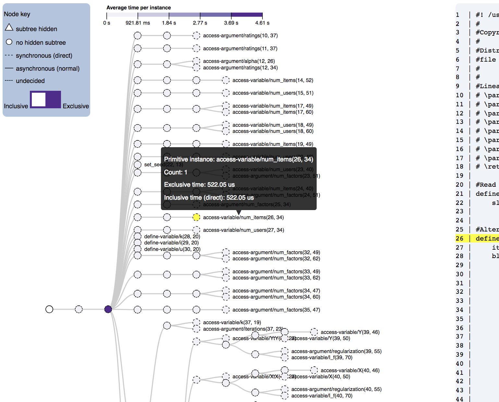

# expression-trees
Generating d3 expression tree visualizations with Newick-formatted trees.

Reingold-Tilford tree:


# To use
You will need [Flask](http://flask.pocoo.org/) installed in order to host the web pages for the visualizations. 

This Flask application follows the typical format with a Python file that establishes the browser and hosts the webpages, a `static` folder that holds the data about the trees, and the `templates` folder that holds the HTML files with the Javascript that display the data. 

To use, first save the Newick-formatted tree into a text file and the performance data into a csv. Be sure that the column headers ("count", "time", etc.) are the first line of the csv. Put the text file and csv file into the `static` folder. To run the program, enter `python tree.py static/myperformancedata.csv static/mynewicktree.txt` into the command line. Additionally, if you want to run the codeview version, add the `.physl` filename to the line: `python tree.py static/myperformancedata.csv static/mynewicktree.txt static/myphysl.physl`.

# Example

In `static` are the test files that I used. The performance data is stored in `20180625_perfdata_alsmovie.csv`. The tree structure is stored in `20180625_treeformat_alsmovie.txt`. The physl file is `als.physl`. The full command: `python tree.py static/20180625_perfdatalsmovie.csv static/20180625_treeformat_alsmovie.txt static/als.physl`. If things run properly, you should see 
```
 * Running on http://0.0.0.0:8001/ (Press CTRL+C to quit)
 * Restarting with stat
 * Debugger is active!
 * Debugger PIN: 244-671-421
127.0.0.1 - - [29/Jun/2018 16:16:45] "GET /codeview HTTP/1.1" 200 -
127.0.0.1 - - [29/Jun/2018 16:16:45] "GET /codeview HTTP/1.1" 200 -
```
and see the tree at http://0.0.0.0:8001/.

# Known issues
In this version of Indented Rectangles tree (), collapsing nodes via clicking does not work (likely linked to coloring issues).


